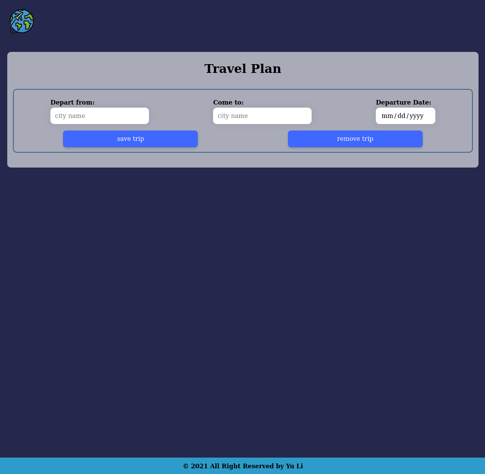
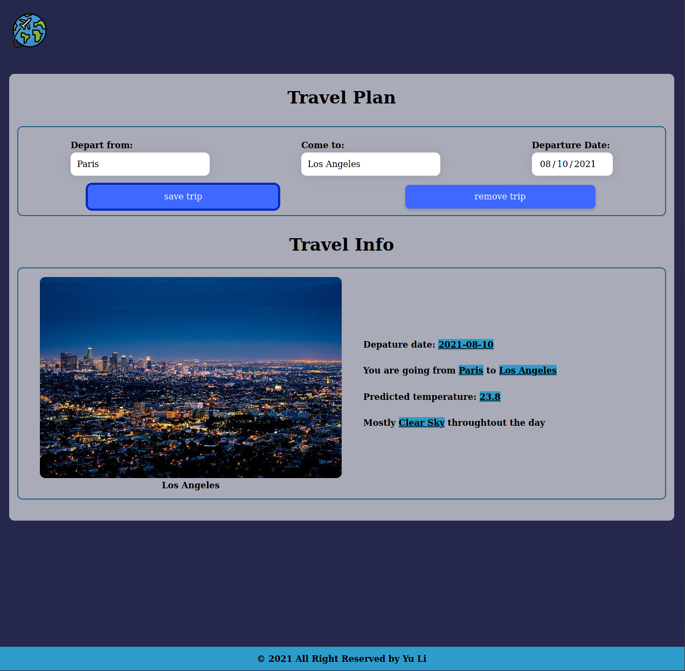

# FEND Capstone - Travel App

## Project Overview
This project builds out a travel app that, at a minimum, obtains a desired trip location & date from the user, and displays weather and an image of the location using information obtained from external APIs.

### Run the Travel APP

```terminal
npm install
npm run build
npm start
```

### Test the Travel APP

```terminal
npm test
```

## Project Instructions
1. Get webpack set up
    - Construct project structure
    - Set up `package.json` and `npm install`
    - Set up webpack config (webpack.dev.js and webpack.prod.js)
2. Create accounts with `Geonames`, `Weatherbit`, and `Pixabay`
3. Integrate these APIs with DOM events
4. Display the results from these APIs

### Architecture of the Project
```
- Root:
  - package.json
  - README.md
  - webpack.dev.js
  - webpack.prod.js
  - .babelrc
  - __test__
  - src
    - server
      - server.js  
    - client
      - index.js
      - views
        - index.html
      - js
        - app.js 
      - styles
        - reset.scss
        - style.scss 
```

## Screenshots

<p align="center">
  
</p>

<p align="center">
  
</p>

## Specification
#### Development Environment and Architecture

| CRITERIA             | MEETS SPECIFICATIONS                                         |
| -------------------- | ------------------------------------------------------------ |
| Architecture         | The project should have a structure like the one shown below. All files shown must be present (Webpack may be split into multiple config files, and names may differ) and the app must successfully render a home page with clear design and functionality added when index.html is loaded in the browser. The project should not contain errors in the browser console. |
| Webpack              | Webpack config should contain at least 3 scripts, express server, build and test. Additionally, dev server may be included. |
| Testing              | - Check if Jest has been installed and npm run test script is implemented to run Jest.<br/>- There should be at least one test for the express server.<br/>- There should be at least one test for the application javascript client. |
| Offline capabilities | The project must have service workers installed.             |

#### HTML & CSS

| CRITERIA       | MEETS SPECIFICATIONS                                         |
| -------------- | ------------------------------------------------------------ |
| Usability      | All features are usable across modern desktop and phone browsers.<br/>Ensure the HTML elements, eg. texts and buttons, are proportionate and readable in small screen devices. |
| Styling        | Styling is set up in a logical way. All interactive elements have hover states. |
| HTML Structure | HTML structure should be indented properly with classes and ID’s that make sense. |
| Visual Design  | The design should clearly be different from the design used in projects 3 and 4. |

#### API and JS Integration

| CRITERIA                                | MEETS SPECIFICATIONS                                         |
| --------------------------------------- | ------------------------------------------------------------ |
| Server<br/>`src > server > server.js`   | `server.js` file should be taken directly from passed project 3 with the addition of added member: value pairs and the required API keys. |
| index.js<br/>`src > client > index.js`  | At least one function should be imported.<br/>At least one event listener should be imported.<br/>(styles referenced in html/css) |
| app.js<br/>`src > client > js > app.js` | 1. There should be URLS and API Keys for at least 3 APIs, including Geonames, Weatherbit, and Pixabay. You can feel free to use more than 3 APIs.<br/>2. There should be a primary object with placeholder member value pairs.<br/>3. There should be a primary function that is exported to index.js (index.js file should import the functions from other files). |

#### Documentation

| CRITERIA     | MEETS SPECIFICATIONS                                         |
| ------------ | ------------------------------------------------------------ |
| README       | A README file is included detailing the app and all dependencies.<br/>Other requirements:<br/>The Readme file should have non-default text in it that is specific to this project. It doesn’t have to be thorough, but should have some basic info. Bonus points if correct markdown is used. |
| Comments     | Comments are present and effectively explain longer code procedure when necessary. |
| Code Quality | Code is formatted with consistent, logical, and easy-to-read formatting as described in the Udacity JavaScript Style Guide. |


## Extra Feature

- Allow the user to remove the trip
    - click the 'remove trip' button to clear all input fields and hidden the 'travel info' section
