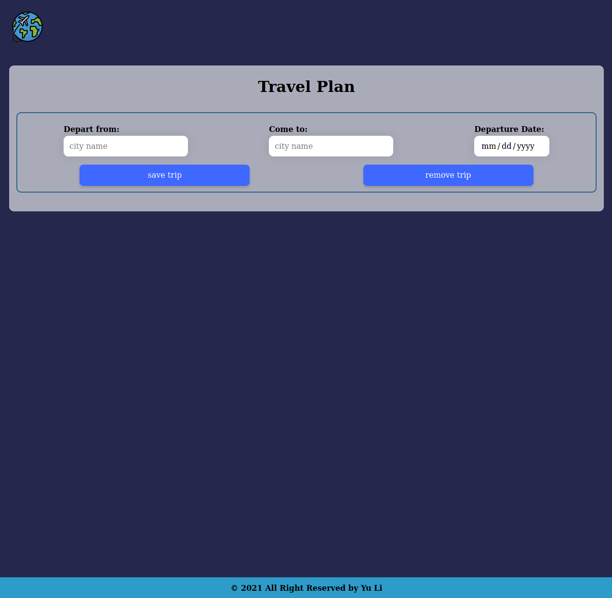
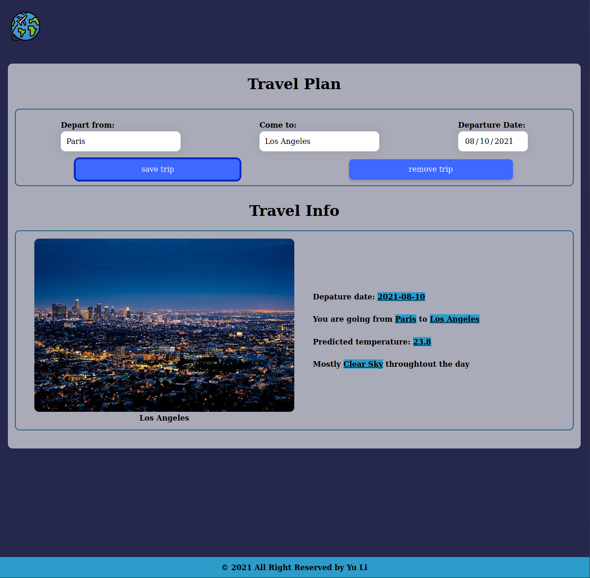

# FEND Capstone - Travel App

## Project Overview
This project builds out a travel app that, at a minimum, obtains a desired trip location & date from the user, and displays weather and an image of the location using information obtained from external APIs.

## Project Instructions
1. Get webpack set up
    - Construct project structure
    - Set up `package.json` and `npm install`
    - Set up webpack config (webpack.dev.js and webpack.prod.js)
2. Create accounts with `Geonames`, `Weatherbit`, and `Pixabay`
3. Integrate these APIs with DOM events
4. Display the results from these APIs

### Architecture of the Project
```
- Root:
  - package.json
  - README.md
  - webpack.dev.js
  - webpack.prod.js
  - .babelrc
  - __test__
  - src
    - server
      - server.js  
    - client
      - index.js
      - views
        - index.html
      - js
        - app.js 
      - styles
        - reset.scss
        - style.scss 
```

### Run the Travel APP

```terminal
npm run dev
npm run build
npm start
```

### Test the Travel APP

```terminal
npm test
```

## Screenshots

<p align="center">
  
</p>

<p align="center">
  
</p>
